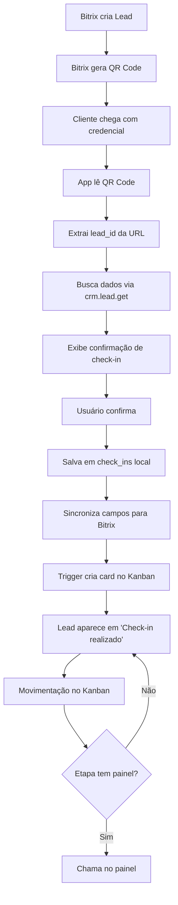

# Arquitetura Bitrix-First: Fluxo Completo de Check-in e Kanban

## 🎯 Visão Geral

Este sistema implementa um fluxo operacional onde **o Bitrix é a fonte de verdade** para os leads, e o sistema MaxCheckin gerencia o atendimento físico na agência através de Kanban visual e painéis de chamada sincronizados em tempo real.

## 📋 Fluxo Operacional Completo



## 🔗 Integração com Bitrix

### 1. Geração da Credencial (Bitrix)

O **Bitrix é responsável** por:
- Criar o lead
- Gerar o QR Code da credencial
- O QR Code contém a URL direta do lead, exemplo:
  ```
  https://maxsystem.bitrix24.com/crm/lead/details/12345/
  ```

### 2. Leitura do QR Code (Check-in)

**Formatos aceitos**:
- URL completa: `https://maxsystem.bitrix24.com/crm/lead/details/12345/`
- URL sem trailing slash: `https://maxsystem.bitrix24.com/crm/lead/details/12345`
- Apenas o ID numérico: `12345` (legacy support)

**Processo**:
```typescript
// 1. Parse da URL
const parsedLeadId = parseBitrixLeadId(qrCodeContent);
// Exemplo: "https://...details/12345/" → "12345"

// 2. Busca no Bitrix
GET ${webhookUrl}/crm.lead.get.json?ID=12345

// 3. Exibe dados para confirmação
// - Nome do modelo
// - Responsável
// - Telefone
// - Foto (se houver)
```

### 3. Campos Sincronizados

Quando o check-in é **confirmado**, estes campos são atualizados no Bitrix:

| Campo Bitrix | Código | Valor | Descrição |
|--------------|--------|-------|-----------|
| **SOURCE_ID** | `SOURCE_ID` | `'CALL'` | Fonte "Recepção" (apenas se criando novo lead) |
| **Projeto** | `PARENT_ID_1120` | `4` | Seletiva atual |
| **Unidade** | `UF_CRM_1741215746` | `4` | Agência |
| **Responsável** | `UF_CRM_1744900570916` | (nome) | Quem fez agendamento |
| **Nome Modelo** | `UF_CRM_LEAD_1732627097745` | (nome) | Nome principal na ficha |
| **⭐ Timestamp** | `UF_CRM_1755007072212` | ISO 8601 | **Data/hora de chegada** |
| **⭐ Foto** | `UF_CRM_1745431662` | URL/Base64 | **Foto do modelo** |

> ⭐ = Campos sincronizados de volta para o Bitrix no momento do check-in

**Código de sincronização**:
```typescript
// Após salvar check-in localmente
await syncCheckInToBitrix(leadId, photo);

// Função interna
const fields = {
  UF_CRM_1755007072212: new Date().toISOString(), // Timestamp
  UF_CRM_1745431662: photo // Foto (se houver)
};

await fetch(`${webhookUrl}/crm.lead.update.json`, {
  method: 'POST',
  body: JSON.stringify({ id: leadId, fields })
});
```

## 🗂️ Estrutura de Dados

### Tabelas Locais (Supabase)

#### check_ins
Registra cada check-in confirmado:
```sql
CREATE TABLE check_ins (
  id uuid PRIMARY KEY,
  lead_id text NOT NULL,        -- ID do lead no Bitrix
  model_name text,               -- Nome do modelo
  model_photo text,              -- URL da foto
  responsible text,              -- Responsável pelo lead
  checked_in_at timestamptz DEFAULT now(),
  created_at timestamptz DEFAULT now()
);
```

#### kanban_stages
Etapas do fluxo interno:
```sql
CREATE TABLE kanban_stages (
  id uuid PRIMARY KEY,
  name text NOT NULL,
  position int NOT NULL,
  panel_id uuid REFERENCES panels(id),  -- Painel vinculado
  is_default boolean DEFAULT false,      -- Primeira etapa?
  created_at timestamptz DEFAULT now()
);
```

#### kanban_cards
Cards representando os leads:
```sql
CREATE TABLE kanban_cards (
  id uuid PRIMARY KEY,
  lead_id text NOT NULL,         -- Referência ao Bitrix
  model_name text,
  responsible text,
  stage_id uuid REFERENCES kanban_stages(id),
  position int NOT NULL,
  created_at timestamptz DEFAULT now()
);
```

#### kanban_events
Auditoria completa de movimentações:
```sql
CREATE TABLE kanban_events (
  id uuid PRIMARY KEY,
  lead_id text NOT NULL,
  from_stage_id uuid REFERENCES kanban_stages(id),
  to_stage_id uuid REFERENCES kanban_stages(id),
  method text CHECK (method IN ('kanban', 'checkin')),
  by_user uuid,
  created_at timestamptz DEFAULT now()
);
```

## 🔄 Automações

### 1. Criação Automática de Card

**Trigger**: `trg_kanban_add_card_on_checkin`

```sql
-- Ao inserir em check_ins
INSERT INTO check_ins (lead_id, model_name, ...) VALUES (...);

-- Trigger automaticamente cria
INSERT INTO kanban_cards (
  lead_id, 
  model_name, 
  stage_id,  -- etapa default
  position
) VALUES (...);
```

### 2. Chamada Automática em Painel

**Quando**: Card é movido para etapa com `panel_id` configurado

```typescript
// No KanbanBoard.tsx
const moveCardToStage = async (card, toStageId) => {
  // ... atualiza posição do card ...
  
  // Se etapa de destino tem painel
  const targetStage = stages.find(s => s.id === toStageId);
  if (targetStage?.panel_id) {
    // Insere chamada
    await supabase.from('calls').insert({
      panel_id: targetStage.panel_id,
      lead_id: card.lead_id,
      model_name: card.model_name,
      source: 'kanban'
    });
  }
};
```

### 3. Botão "Chamar Agora"

**Quando**: Operador clica no botão do card

**Efeito**: 
- Cria chamada no painel **sem mover o card**
- Útil para rechamar ou chamar sem progredir no fluxo

```typescript
const handleCallNow = async (card) => {
  const currentStage = stages.find(s => s.id === card.stage_id);
  if (currentStage?.panel_id) {
    await supabase.from('calls').insert({
      panel_id: currentStage.panel_id,
      lead_id: card.lead_id,
      source: 'kanban_call_now'
    });
  }
};
```

## 🎨 Interface de Usuário

### Check-in (src/pages/CheckInNew.tsx)

**Fluxo**:
1. Scanner QR ativo
2. QR lido → Parse URL → Extrai lead_id
3. Busca dados no Bitrix
4. Exibe modal de confirmação:
   - Nome do modelo ✏️ editável
   - Foto
   - Responsável
   - Lead ID
5. Botão "Confirmar Check-in"
6. Salva localmente + Sincroniza com Bitrix
7. Tela de boas-vindas
8. Auto-reset do scanner

**Funcionalidades**:
- ✅ Leitura de QR Code (câmera ou USB scanner)
- ✅ Busca manual por ID
- ✅ Busca por telefone
- ✅ Criação de novo lead (fallback)
- ✅ Edição de dados antes de confirmar
- ✅ Sincronização automática com Bitrix

### Kanban (src/pages/admin/KanbanBoard.tsx)

**Visualização**:
```
┌─────────────────┬─────────────────┬─────────────────┐
│ Check-in        │ Atend. Produtor │ Prod. de Moda  │
│                 │                 │                 │
│ ┌─────────────┐ │ ┌─────────────┐ │ ┌─────────────┐│
│ │ Maria Silva │ │ │ João Santos │ │ │ Ana Costa   ││
│ │ Lead #12345 │ │ │ Lead #12346 │ │ │ Lead #12347 ││
│ │ Resp: Paulo │ │ │ Resp: Ana   │ │ │ Resp: João  ││
│ │ [📞 Chamar] │ │ │ [📞 Chamar] │ │ │ [📞 Chamar] ││
│ └─────────────┘ │ └─────────────┘ │ └─────────────┘│
└─────────────────┴─────────────────┴─────────────────┘
```

**Funcionalidades**:
- ✅ Drag-and-drop entre etapas
- ✅ Botão "Chamar agora" em cada card
- ✅ Configuração de painel por etapa
- ✅ Criação de novas etapas
- ✅ Reordenação de cards na mesma etapa

### Painéis (src/pages/PainelDinamico.tsx)

**Exibição em tempo real**:
```
╔═══════════════════════════════════════╗
║     PAINEL - ATENDIMENTO PRODUTOR     ║
║                                       ║
║   → Chamando:                         ║
║     MARIA SILVA                       ║
║     Lead #12345                       ║
║     Sala 2                            ║
║                                       ║
║   Última chamada: 14:35               ║
╚═══════════════════════════════════════╝
```

**Características**:
- Realtime via Supabase subscriptions
- URL: `/painel/:slug`
- Auto-atualiza ao receber nova chamada
- Exibe: Nome, ID, Sala (se configurado)

## 🔐 Segurança (RLS)

### Políticas de Acesso

```sql
-- Etapas: todos autenticados podem ler
CREATE POLICY "auth can read stages" 
  ON kanban_stages FOR SELECT 
  USING (auth.uid() IS NOT NULL);

-- Etapas: apenas admins podem gerenciar
CREATE POLICY "admins manage stages"
  ON kanban_stages FOR ALL
  USING (has_role(auth.uid(), 'admin'));

-- Cards: operadores e admins podem gerenciar
CREATE POLICY "operators update cards"
  ON kanban_cards FOR UPDATE
  USING (
    has_role(auth.uid(), 'admin') OR 
    has_role(auth.uid(), 'operator')
  );
```

## 📊 Queries Úteis

### Verificar check-ins do dia
```sql
SELECT 
  ci.lead_id,
  ci.model_name,
  ci.responsible,
  ci.checked_in_at,
  kc.id as card_id,
  ks.name as current_stage
FROM check_ins ci
LEFT JOIN kanban_cards kc ON kc.lead_id = ci.lead_id
LEFT JOIN kanban_stages ks ON ks.id = kc.stage_id
WHERE ci.checked_in_at >= CURRENT_DATE
ORDER BY ci.checked_in_at DESC;
```

### Auditoria de movimentações
```sql
SELECT 
  ke.lead_id,
  ke.method,
  fs.name as from_stage,
  ts.name as to_stage,
  ke.created_at
FROM kanban_events ke
LEFT JOIN kanban_stages fs ON fs.id = ke.from_stage_id
LEFT JOIN kanban_stages ts ON ts.id = ke.to_stage_id
WHERE ke.created_at >= CURRENT_DATE
ORDER BY ke.created_at DESC;
```

### Verificar configuração de painéis
```sql
SELECT 
  ks.name as stage_name,
  ks.position,
  p.name as panel_name,
  p.slug as panel_slug,
  COUNT(kc.id) as cards_count
FROM kanban_stages ks
LEFT JOIN panels p ON p.id = ks.panel_id
LEFT JOIN kanban_cards kc ON kc.stage_id = ks.id
GROUP BY ks.id, ks.name, ks.position, p.name, p.slug
ORDER BY ks.position;
```

## 🚀 Deploy e Configuração

### 1. Aplicar Migration

```bash
# Via Supabase CLI
supabase db push

# Ou executar SQL manualmente
psql < supabase/migrations/20251031_kanban_crm.sql
```

### 2. Configurar Webhook Bitrix

1. Acesse `/admin/webhooks`
2. Insira a URL do webhook Bitrix
3. Teste a conexão

### 3. Mapear Campos

1. Acesse `/admin/field-mapping`
2. Configure mapeamento entre Bitrix e MaxCheckin:
   - `UF_CRM_LEAD_1732627097745` → `model_name`
   - `ASSIGNED_BY_ID` → `responsible`
   - etc.

### 4. Configurar Etapas e Painéis

1. Acesse `/admin/kanban`
2. Para cada etapa, clique em ⚙️
3. Selecione o painel vinculado
4. Salve

### 5. Criar Painéis

1. Acesse `/admin/panels`
2. Crie um painel para cada etapa
3. Configure nome e slug
4. Acesse `/painel/:slug` em uma tela separada

## 🧪 Testes Manuais

### Teste 1: Check-in via QR
1. Gere um QR Code com URL do Bitrix
2. Leia no scanner
3. Confirme que dados são exibidos
4. Confirme check-in
5. Verifique card criado na primeira etapa

### Teste 2: Movimentação no Kanban
1. Arraste card para próxima etapa
2. Se etapa tem painel, verifique chamada
3. Verifique audit log em `kanban_events`

### Teste 3: Chamada Manual
1. Clique em "Chamar agora" no card
2. Verifique painel recebe chamada
3. Verifique card não mudou de etapa

### Teste 4: Sincronização Bitrix
1. Faça check-in
2. No Bitrix, verifique campo `UF_CRM_1755007072212` atualizado
3. Verifique foto sincronizada (se houver)

## 📝 Próximos Passos

### Fase 2 - Melhorias
- [ ] Tempo médio por etapa (SLA)
- [ ] Painel supervisor consolidado
- [ ] Fila de prioridade (VIP, idade)
- [ ] Notificações SMS/Email
- [ ] Integração com atividades Bitrix

### Fase 3 - Automação
- [ ] Voz automática nos painéis
- [ ] Progressão automática baseada em regras
- [ ] Webhooks para eventos externos
- [ ] Relatórios e dashboards analíticos

## 🆘 Troubleshooting

### Card não é criado no check-in
```sql
-- Verificar se trigger existe
SELECT * FROM pg_trigger 
WHERE tgname = 'trg_kanban_add_card_on_checkin';

-- Verificar etapa default
SELECT * FROM kanban_stages WHERE is_default = true;
```

### Painel não recebe chamada
```sql
-- Verificar se etapa tem painel
SELECT ks.name, ks.panel_id, p.name as panel_name
FROM kanban_stages ks
LEFT JOIN panels p ON p.id = ks.panel_id;

-- Verificar chamadas criadas
SELECT * FROM calls 
WHERE created_at >= CURRENT_DATE
ORDER BY created_at DESC;
```

### Sincronização com Bitrix falha
- Verificar webhook configurado
- Testar chamada manual: `crm.lead.update.json`
- Verificar permissões do webhook
- Checar logs do browser console

## 📚 Referências

- [Bitrix24 REST API](https://training.bitrix24.com/rest_help/)
- [Supabase Realtime](https://supabase.com/docs/guides/realtime)
- [@dnd-kit Documentation](https://docs.dndkit.com/)
- [React Router v6](https://reactrouter.com/en/main)

---

**Última atualização**: 31 de Outubro de 2025
**Versão**: 2.0 (Bitrix-first architecture)
